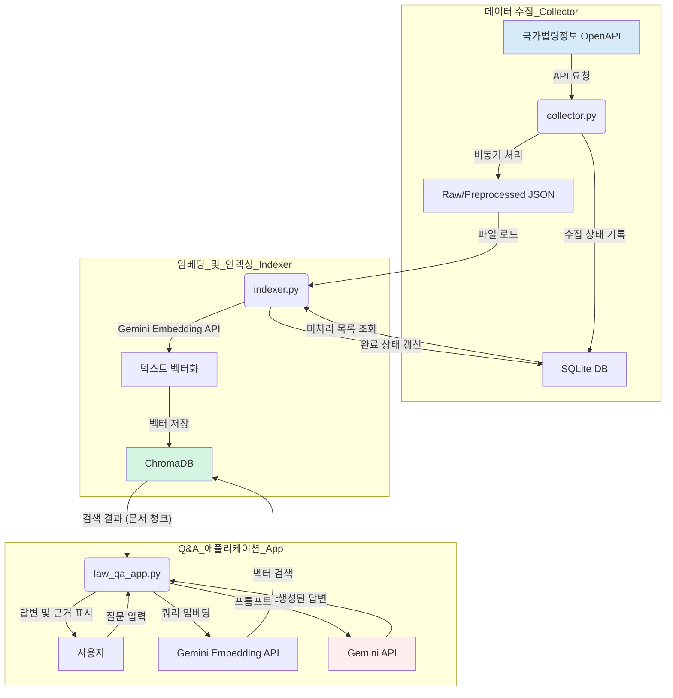

You can also read to [English](./README_en.md)!

---

# ⚖️ LawBot: Gemini 기반 법률/판례 분석 및 Q&A 시스템

[](https://www.python.org/)
[](https://ai.google.dev/)
[](https://streamlit.io/)
[](https://www.trychroma.com/)
[](https://opensource.org/licenses/MIT)

LawBot은 대한민국 법령과 판례 데이터를 기반으로 사용자의 법률 질문에 깊이 있는 답변을 제공하는 RAG(Retrieval-Augmented Generation) 시스템입니다. 국가법령정보 OpenAPI를 통해 데이터를 비동기적으로 수집하고, Gemini 임베딩 모델로 벡터화하여 ChromaDB에 저장합니다. 사용자의 질문이 들어오면, 관련된 법률/판례 조각을 검색하여 Gemini 모델에 컨텍스트로 제공함으로써 환각(Hallucination)을 최소화하고 근거 기반의 정확한 답변을 생성합니다.

---

## 🌎 Live Demo & 시연 영상

직접 LawBot의 성능을 체험해 보세요!

-   **Live Demo:** **[https://lawbot.uiharu.dev](https://lawbot.uiharu.dev)**
-   **시연 영상:**

    <video src="https://github.com/gaon12/lawbot/blob/main/README/videos/demo.mp4"></video>


## ✨ 주요 특징 (Key Features)

-   **완전 비동기 데이터 수집 파이프라인**:
    -   `asyncio`와 `aiohttp`를 활용하여 국가법령정보 OpenAPI의 법령 및 판례 데이터를 네트워크 I/O 병목 없이 빠르게 수집합니다.
    -   `aiosqlite`를 사용하여 수집 상태를 비동기적으로 DB에 기록, 안정적인 데이터 관리와 재수집/업데이트를 지원합니다.

-   **Gemini 최신 모델 활용**:
    -   `gemini-embedding-exp-03-07` 모델을 사용하여 법률 텍스트를 고차원 벡터로 임베딩합니다.
    -   `gemini-2.5-flash` 모델을 답변 생성에 사용하여 복잡한 법률 질의에 대한 논리적이고 구조화된 답변을 생성합니다.

-   **고도화된 RAG 및 답변 품질 향상**:
    -   **계층적 텍스트 분할**: '문단 → 문장 → 고정 길이' 3단계 분할로 긴 법률 원문의 의미를 최대한 보존하며 임베딩에 적합한 청크(chunk)를 생성합니다.
    -   **환각 방지**: 검색된 법령/판례 ID의 유효성을 SQLite DB와 대조하여 모델이 존재하지 않는 근거를 제시하는 것을 방지합니다.
    -   **근거 명시 및 각주 자동 생성**: 답변에 사용된 모든 근거는 각주(`[^1]`) 형태로 본문에 표시되고, 답변 하단에 출처 목록을 자동으로 생성하여 신뢰도를 높입니다.

-   **Chain-of-Thought (CoT) 시각화**:
    -   Gemini 모델이 답변을 생성하기까지의 단계별 추론 과정(`<think>...</think>`)을 추출하여 사용자에게 투명하게 공개합니다. 이를 통해 사용자는 AI가 어떤 논리적 단계를 거쳐 결론에 도달했는지 파악할 수 있습니다.

-   **효율적인 개발 및 운영**:
    -   **모듈화된 3단계 스크립트**: `수집(collector)` → `임베딩(indexer)` → `실행(app)`으로 역할이 명확히 분리되어 유지보수가 용이합니다.
    -   **상태 기반 인덱싱**: 이미 임베딩된 문서는 SQLite의 `indexed` 플래그로 관리하여, 불필요한 중복 작업을 피하고 변경된 내용만 효율적으로 업데이트합니다.

## 🏗️ 시스템 아키텍처 (System Architecture)



## 🛠️ 기술 스택 (Tech Stack)

-   **Backend**: Python, aiohttp, aiosqlite
-   **AI/ML**: Google Gemini, ChromaDB
-   **Frontend**: Streamlit
-   **Infrastructure**: asyncio, ThreadPoolExecutor
-   **Utilities**: python-dotenv, tqdm

## 🚀 설치 및 실행 방법 (Setup and How to Run)

### 1. 프로젝트 복제

```bash
git clone https://github.com/your-username/lawbot.git
cd lawbot
```

### 2. 환경 변수 설정

프로젝트 루트에 `.env` 파일을 생성하고 아래 내용을 채워주세요.

```env
# 1. collector.py용: 국가법령정보 OpenAPI 인증키
# https://www.law.go.kr/LSW/opn/prvc/opnSvcInfoP.do?vSvcId=OC_OPEN_API_L&vSvcNm=law 에서 신청
API_KEY="YOUR_NATIONAL_LAW_API_KEY"

# 2. indexer.py & law_qa_app.py용: Gemini API 키
# https://ai.google.dev/ 에서 발급
GEMINI_API_KEY="YOUR_GEMINI_API_KEY"
```

### 3. 의존성 설치

`requirements.txt` 파일이 있다면 아래 명령어를 사용하세요. 없다면 수동으로 설치합니다.

```bash
# requirements.txt 사용 시
pip install -r requirements.txt

# 수동 설치 시
pip install aiohttp aiosqlite python-dotenv tqdm chromadb "google-generativeai" streamlit
```

### 4. 실행 순서

아래 순서대로 스크립트를 실행해야 합니다.

**Step 1: 데이터 수집**
> 시간이 오래 걸릴 수 있습니다.

```bash
python collector.py
```
이 과정이 끝나면 `data/laws/raw`, `data/precs/raw` 등에 JSON 파일이 생성되고 `data/laws/laws.db`에 메타데이터가 저장됩니다.

**Step 2: 데이터 임베딩 및 인덱싱**
> 수집된 데이터를 Gemini API를 통해 임베딩하고 ChromaDB에 저장합니다. 이 과정 또한 상당한 시간이 소요됩니다.

```bash
python indexer.py
```
`data/ChromaLegal` 디렉터리에 벡터 데이터가 저장되고, `laws.db`의 `indexed` 플래그가 갱신됩니다.

**Step 3: Q&A 애플리케이션 실행**

```bash
streamlit run law_qa_app.py
```
웹 브라우저에서 `http://localhost:8501` 주소로 접속하여 시스템을 사용할 수 있습니다.


## 📄 라이선스 (License)

이 프로젝트는 [MIT 라이선스](LICENSE)를 따릅니다.
