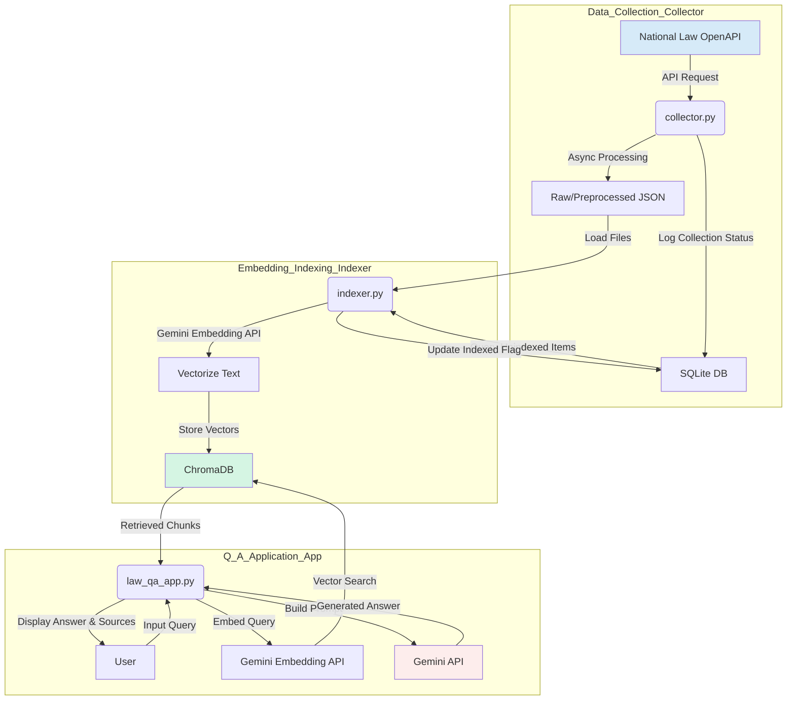

# ⚖️ LawBot: A Gemini-Powered Legal/Precedent Analysis and Q&A System (English)

[](https://www.python.org/)
[](https://ai.google.dev/)
[](https://streamlit.io/)
[](https://www.trychroma.com/)
[](https://opensource.org/licenses/MIT)

LawBot is a Retrieval-Augmented Generation (RAG) system that provides in-depth answers to legal questions based on South Korean laws and judicial precedents. It asynchronously collects data via the National Law Information Center OpenAPI, vectorizes it using the Gemini embedding model, and stores it in ChromaDB. When a user asks a question, the system retrieves relevant legal/precedent fragments and provides them as context to the Gemini model, minimizing hallucinations and generating accurate, evidence-based answers.

---

## 🌎 Live Demo & Video

Experience the power of LawBot for yourself!

-   **Live Demo:** **[https://lawbot.uiharu.dev](https://lawbot.uiharu.dev)**
-   **Demo Video:**
    
    <video src="https://github.com/gaon12/lawbot/blob/main/README/videos/demo.mp4"></video>


## ✨ Key Features

-   **Fully Asynchronous Data Collection Pipeline**:
    -   Utilizes `asyncio` and `aiohttp` to rapidly collect law and precedent data from the National Law Information Center OpenAPI without network I/O bottlenecks.
    -   Uses `aiosqlite` to asynchronously log collection status to a database, ensuring stable data management and supporting re-requests/updates.

-   **Leveraging the Latest Gemini Models**:
    -   Employs the `gemini-embedding-exp-03-07` model to embed legal texts into high-dimensional vectors.
    -   Uses the `gemini-2.5-flash` model for response generation, creating logical and well-structured answers to complex legal queries.

-   **Advanced RAG and Answer Quality Enhancement**:
    -   **Hierarchical Text Splitting**: A 3-tier splitting method ('paragraph → sentence → fixed length') preserves the semantic meaning of long legal texts while creating chunks suitable for embedding.
    -   **Hallucination Prevention**: Validates retrieved law/precedent IDs against the SQLite DB to prevent the model from citing non-existent sources.
    -   **Evidence-based Citations**: All sources used in an answer are marked with footnotes (`[^1]`) in the body, and a source list is automatically generated at the end to enhance credibility.

-   **Chain-of-Thought (CoT) Visualization**:
    -   Extracts and transparently displays the step-by-step reasoning process (`<think>...</think>`) that the Gemini model follows to generate an answer. This allows users to understand the logical steps the AI took to reach its conclusion.

-   **Efficient Development and Operation**:
    -   **Modular 3-Step Scripts**: Clear separation of roles into `collector`, `indexer`, and `app` makes maintenance straightforward.
    -   **State-based Indexing**: Documents that have already been embedded are managed with an `indexed` flag in SQLite, avoiding redundant processing and efficiently updating only changed content.

## 🏗️ System Architecture



## 🛠️ Tech Stack

-   **Backend**: Python, aiohttp, aiosqlite
-   **AI/ML**: Google Gemini, ChromaDB
-   **Frontend**: Streamlit
-   **Infrastructure**: asyncio, ThreadPoolExecutor
-   **Utilities**: python-dotenv, tqdm

## 🚀 Setup and How to Run

### 1. Clone the Repository

```bash
git clone https://github.com/your-username/lawbot.git
cd lawbot
```

### 2. Set Up Environment Variables

Create a `.env` file in the project root and add the following content.

```env
# 1. For collector.py: National Law Information OpenAPI Key
# Apply at: https://www.law.go.kr/LSW/opn/prvc/opnSvcInfoP.do?vSvcId=OC_OPEN_API_L&vSvcNm=law
API_KEY="YOUR_NATIONAL_LAW_API_KEY"

# 2. For indexer.py & law_qa_app.py: Gemini API Key
# Get it from: https://ai.google.dev/
GEMINI_API_KEY="YOUR_GEMINI_API_KEY"
```

### 3. Install Dependencies

If a `requirements.txt` file is provided, use the command below. Otherwise, install manually.

```bash
# Using requirements.txt
pip install -r requirements.txt

# Manual installation
pip install aiohttp aiosqlite python-dotenv tqdm chromadb "google-generativeai" streamlit
```

### 4. Running the Scripts

The scripts must be executed in the following order.

**Step 1: Data Collection**
> This may take a long time.

```bash
python collector.py
```
This process will generate JSON files in `data/laws/raw`, `data/precs/raw`, etc., and save metadata to `data/laws/laws.db`.

**Step 2: Data Embedding and Indexing**
> This step embeds the collected data via the Gemini API and saves it to ChromaDB. This process is also very time-consuming.

```bash
python indexer.py
```
Vector data will be stored in the `data/ChromaLegal` directory, and the `indexed` flag in `laws.db` will be updated.

**Step 3: Run the Q&A Application**

```bash
streamlit run law_qa_app.py
```
Open your web browser and navigate to `http://localhost:8501` to use the system.

## 📄 License

This project is licensed under the [MIT License](LICENSE).